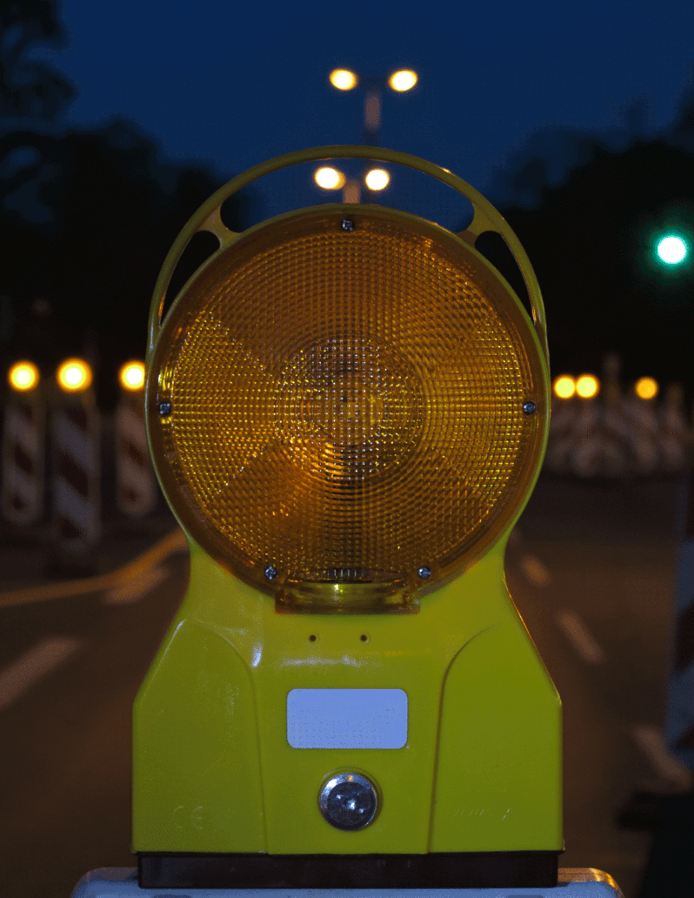
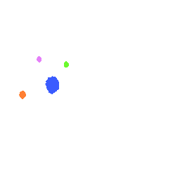

# Delay Wheels | Kaylee Kuang

## Instructions on how to interact with the work
In this animation, each wheel is drawn and erased at intervals with random delays. First, a new wheel is drawn on the screen with a random delay (between 100 milliseconds and 500 milliseconds), and each wheel is drawn in this manner. When all wheels have been drawn, a wait of 1000 milliseconds is made, and then erasing of the wheels begins in reverse order, also with random delays between each erasing action. Once the erasure is complete, it waits another 1000 milliseconds and then starts drawing the wheels again, and so on, creating a continuous, organic and dynamic visual display.

## Details of individual approach

- Using approach：Time-Based

- Animated Properties
  
  Animates the properties of the position, color, and number of wheels by controlling the delayed drawing and erasing process of the wheels. And dynamically appear and disappear with random positions and colors.

- Inspiration
  
  When I saw this gif I considered flashing as an animation effect. The yellow lights light up and go out to create a strong visual contrast in the image. Therefore, this flashing animation effect in my project refers to the dynamic visual contrast created by controlling the appearance and disappearance of the wheels.

  
  The spots within this gif appear one by one, but they don't appear at fixed intervals. This got me thinking about having the animation occur not to obey a fixed time interval, but at random intervals within a time frame.

- Technical explanation

  1. drawNextWheel(): Draws the next wheel and repeats until all wheels are drawn.

  2. drawWheels(): Draws wheels with either lines or dots and additional elements.

  3. eraseNextWheel(): Erases previously drawn wheels one by one.

  4. eraseWheel(): Covers a wheel with the background color to erase it.

  5. [shuffle()](https://p5js.org/reference/#/p5/shuffle): Shuffle the order of the elements in the wheelPositions array to achieve a randomized drawing order of the wheels.

  6. [setTimeout()](https://www.youtube.com/watch?v=nGfTjA8qNDA): Execute the function after a specified delay. This is used here to simulate the delay effect in the animation, so that each wheel is drawn or erased after a random time interval. The reason I didn't use setInterval() is that I wanted the image to be more randomized, which means that the wheels don't appear and disappear following a fixed time interval.
